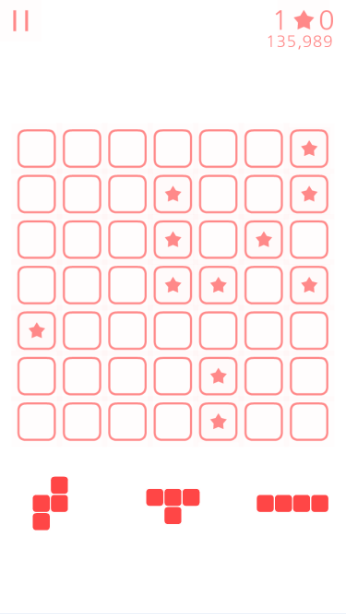
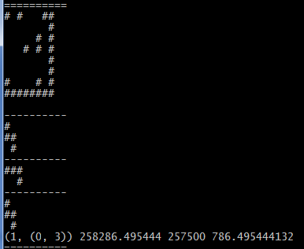

# AlphaLineupPuzzle

该项目是Lineup Puzzle游戏的AI。
命名灵感来自于AlphaGo，
其目的是学习并掌握AlphaGo论文中提到的相关技术。

## 当前进展

- [ ] AlphaLineupPuzzle开发
 - [x] 棋盘
 - [x] 蒙特卡洛树搜索
 - [x] 策略网络
 - [ ] 联合策略网络和蒙特卡洛树搜索
 - [ ] 值网络
 - [ ] 强化学习
 - [ ] AI界面

## v0.1版本的性能

v0.1版本在单核心上运行了8天(11679分钟)，共完成248局游戏。以下是对这248局游戏存档的统计：

name   |sum    |mean   |min    |max
-------|-------|-------|-------|-------
得分   |-      |155943 |4500   |922000
步数   |133309 |537    |23     |3142
候选   |-      |22.85  |0      |100

其中每消除一行得500分。

## 策略网络的性能

神经网络库用的是chainer。只有输入层和输出层，因为更大的深度对准确率的影响不大。

该网络的训练数据来自于v0.1的存档，并旋转、镜面扩展了训练数据。
其中前10%用于测试，后90%用于训练。
其在测试集上的预测准确率为22.5%（纯蒙的话，准确率为4.38%），在训练集上的准确率为23.1%

以下是对仅使用策略网络的ai的性能测试。其中随机走子作为对照组，它仅等概率地挑选合法走子。

执行批次|策略网络|随机走子
--------|--------|--------
第一次  |5540    |1274
第二次  |5512    |1304
第三次  |5318    |1236

其中每个批次都包含248局游戏，分值为这248局的平均得分。

## 截图

游戏界面如下：

AI运行时如下：

